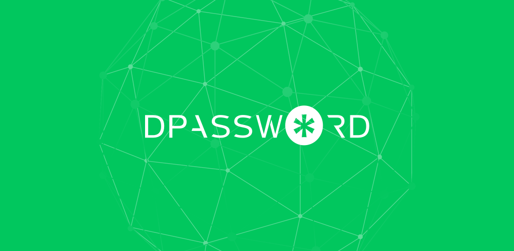

## Dpassword Android Client

Dpassword is a decentralized password manager. Users can create, modify, and delete their own password information. The password information is stored locally with the private key encrypted, and the encrypted cipher text can also be backed up to the Nebulas blockchain for synchronization on any device.
Compared with the traditional password manager, the data is stored on the blockchain to completely eliminate the hidden dangers. The private key is owned by the user. Even if the ciphertext is stolen, there is no need to worry about being maliciously cracked, and there is no disclosure by the centralized service provider. The risk, and using Nebulas Chain to back up the data is also quite cheap.
So Dpassword is safer, more reliable, and it will be your assistant to manage your passwords.

## Author
[Fitz](https://github.com/FitzLu)

